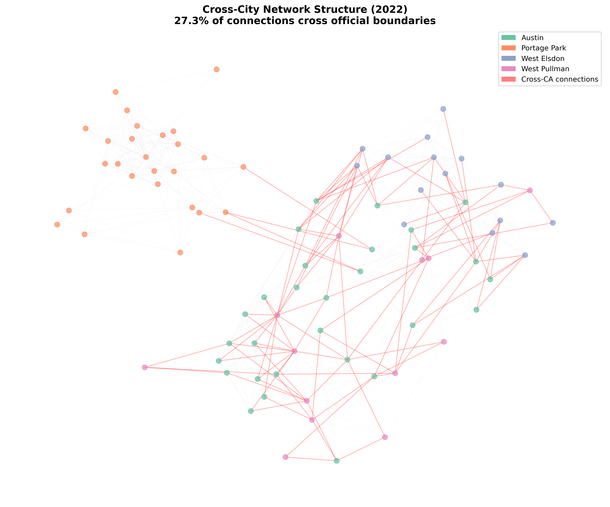
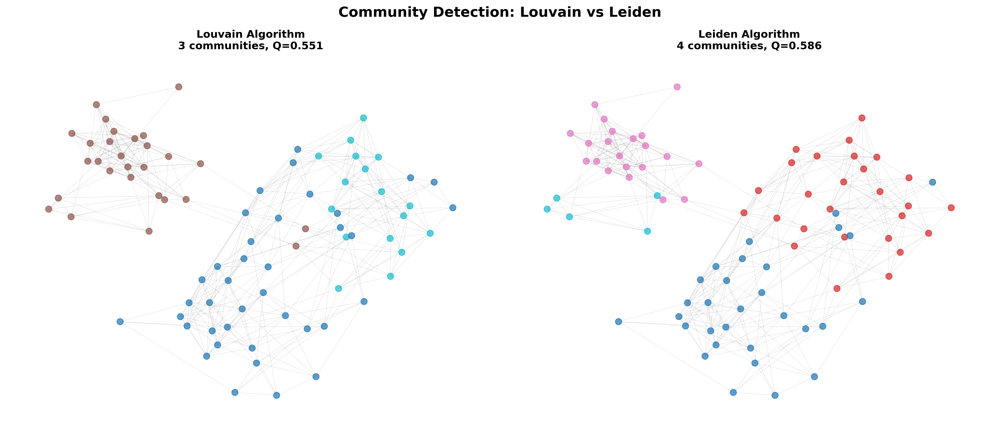
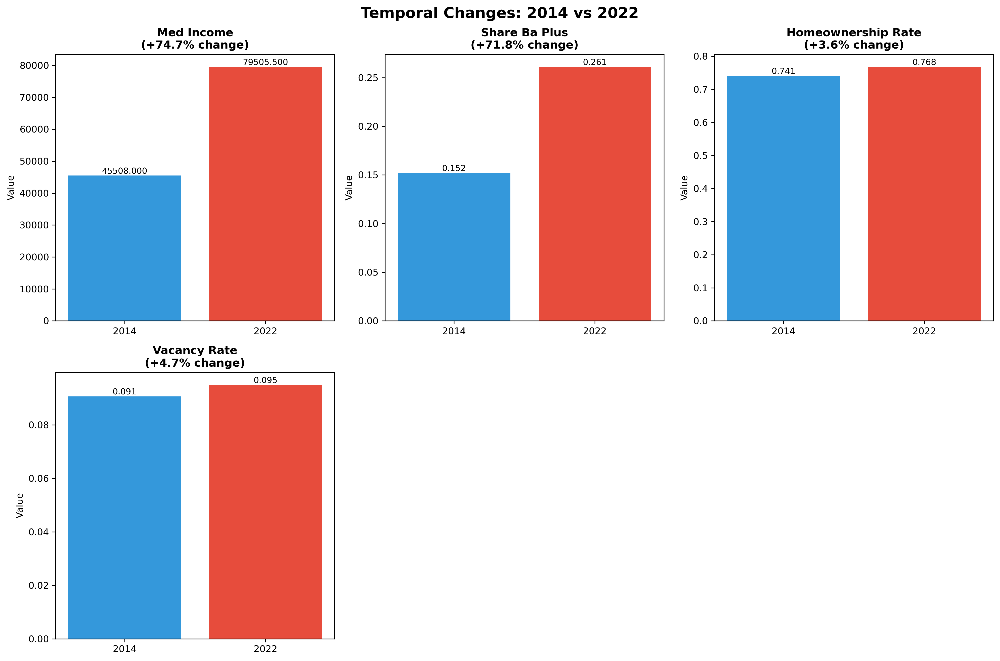
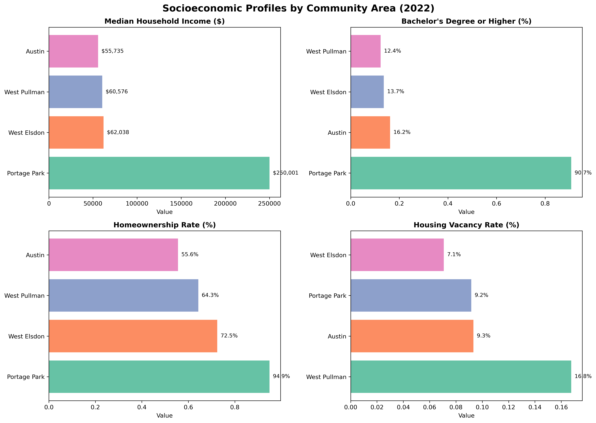
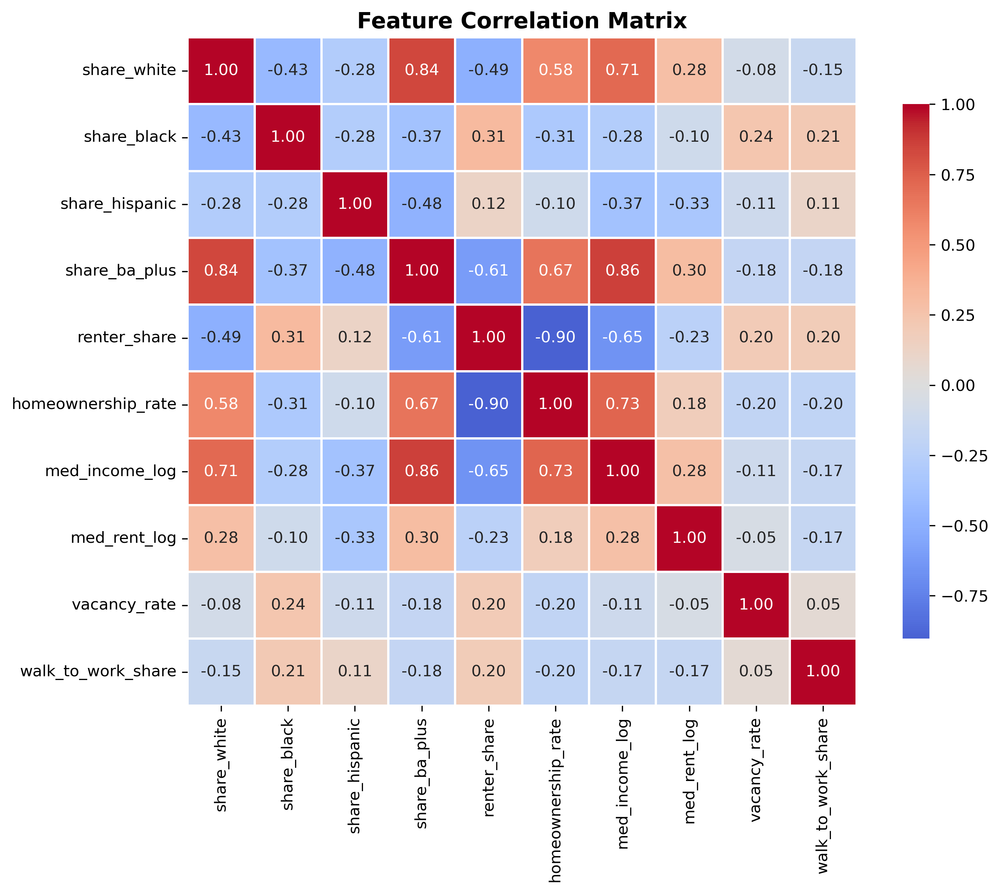

# Data-Driven Chicago Neighborhood Analysis

Network-based community detection study questioning whether Chicago's 
100-year-old community boundaries reflect current socioeconomic reality.

## Key Findings
- **27.3%** of socioeconomic similarity connections cross official boundaries
- **3 communities detected** via Louvain (Q=0.551), **4 via Leiden** (Q=0.586)
- **+74.7% median income growth** observed (2014–2022)
- **+71.8% increase** in bachelor's degree attainment (2014–2022)
- Strong spatial coherence emerged despite no geographic coordinates used

## Results Preview

### Cross-City Network Structure


### Community Detection: Louvain vs Leiden


### Temporal Changes 2014–2022


### Socioeconomic Profiles by Area


### Feature Correlation Matrix


## Study Areas
- **Portage Park (CA 15)** — Northwest Side, middle-class residential
- **Austin (CA 25)** — West Side, lower income
- **West Pullman (CA 53)** — Far South Side, industrial heritage
- **West Elsdon (CA 62)** — Southwest Side, mixed demographics

## How It Works

### Pipeline
1. Fetch census block group data from US Census ACS API (2014 & 2022)
2. Compute 10 socioeconomic features per block group
3. Build k-NN similarity network (cosine similarity, k=10)
4. Run Louvain & Leiden community detection algorithms
5. Compare detected communities vs official boundaries
6. Generate visualizations and interactive map

### Features Used
- Demographics: share white, share black, share hispanic
- Education: bachelor's degree attainment rate
- Housing: homeownership rate, renter share, vacancy rate, median rent (log)
- Economic: median household income (log), walk-to-work share

## Installation

```bash
git clone https://github.com/krishna-reddy-ds/chicago-neighborhood-analysis.git
cd chicago-neighborhood-analysis
bash setup.sh
```

Or manually:
```bash
pip install -r requirements.txt
```

## Usage

```bash
# Get free API key at: census.gov/data/key_signup.html
export CENSUS_API_KEY='your_key_here'

# Run full analysis
python main.py
```

Output saved to `final_figs/`:
- `01_temporal_analysis.png`
- `02_community_comparison.png`
- `03_network_geographic.png`
- `04_feature_correlations.png`
- `05_ca_profiles.png`
- `interactive_map.html`

## Tech Stack
Python · NetworkX · scikit-learn · Pandas · NumPy
Louvain · Leiden · Folium · Matplotlib · Seaborn · Census ACS API

## My Contribution
Responsible for West Pullman (CA 53) analysis — implemented Louvain
and Leiden community detection algorithms, computed network metrics,
generated community structure visualizations, and conducted
temporal analysis comparing 2014 and 2022 data.

## Publication
IEEE-format research paper — IIT Chicago CS579 (2024)
